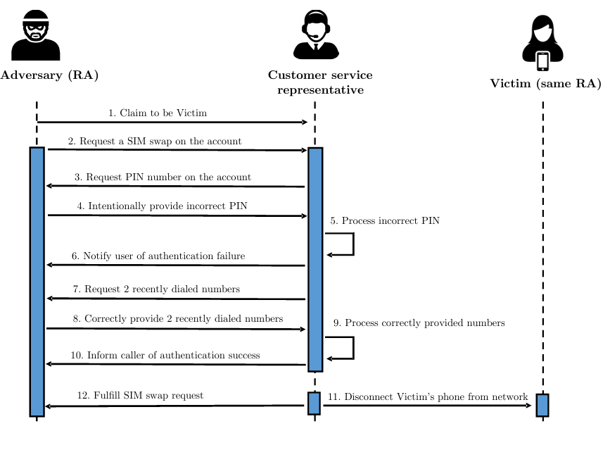

# 模拟SIM卡交换攻击和号码回收攻击

## 基本功能

### 新建设备
一个Client代表一个设备。每个设备有设备号作为区分。用户可以通过设备向Server发送请求，完成一系列操作。

### 申请电话号码
用户可以通过设备向Server发送请求，提供个人姓名、身份证号和PIN码来申请电话号码，Server 会从`Phone number`数据库中随机选取一个未被认领的手机号分配给用户的该设备。一个用户可以申请多个手机号，一个设备只能拥有一个手机号。

### 通话
用户可以使用设备通过Server向其它电话号码发起通话，通话记录会保存在数据库中

## 拔出SIM卡
设备可以主动删除SIM卡，不会注销电话号码

### 电话号码转移
用户更换设备后，要想把手机号从原来的设备转移到新设备上，需要输入手机号申请时的用户姓名、手机号和PIN码。若忘记PIN码，Server会使用其它方式验证用户身份，如最近的两次通话记录等。转移成功后Server会向原先的设备发送解绑信息。

### 电话号码注销
用户可以通过电话号码注册时的姓名、手机号和PIN码注销该手机号。同时，Server拥有直接注销号码的权力。

### 基于电话号码-验证码登录的网站
用户可以通过用户名、密码、电话号码和验证码注册网站用户。用户可以通过用户名-密码、电话号码-密码、电话号码-验证码的方式登陆网站。

## 相关的数据库

**Device Info:** 保存了有关设备的信息，即设备码和手机号

**User Info:** 预先填入，保存了有关用户的个人信息，即姓名，身份证号，出生日期

**Phone Numbers:** 随机生成手机号作为手机号库，保存了有关手机号的信息，即手机号，申请人，PIN码

**Website info:** 网站的用户信息，包含用户名、密码、电话号码

**call records:** 保存了用户间的通话记录，包含时间、发起人和接受人

## SIM卡交换攻击的实现

1.攻击者向受害者拨打电话，引导受害者最后两次通话记录的接受人为攻击者
2.攻击者向服务器发起SIM卡交换申请
3.攻击者在PIN码的验证中失败
4.服务器询问最后两次通话记录
5.攻击者完成验证
6.SIM卡交换成功
7.受害者收到SIM卡被交换的信息
攻击成功

## 号码回收攻击的实现

1.攻击者申请大量的号码
2.攻击着使用号码去各个网站登录
3.攻击者找到受害者曾经注册过的网站
攻击成功