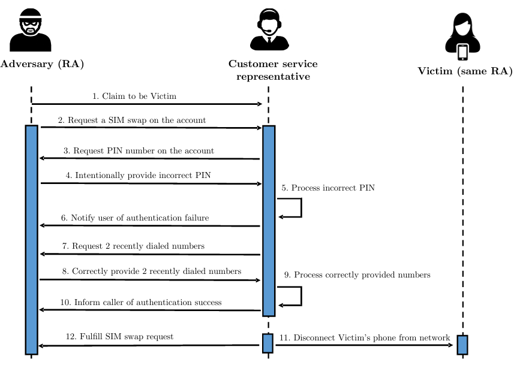

# SUSTech Term Project Report - User Authentication Security

**SID:** 12211712
**Name:** 张柬禾
---

## 一、实验目的
用户认证在现实生活中的应用广泛，认证的安全性深刻影响着个人信息与财产的安全性。本课题参考的论文中针对用户身份认证的三个方向进行研究：SIM卡更换时的用户认证、电话号码回收面临的安全和隐私风险、主流网站的密码策略研究。我们将用实验探索验证安全漏洞的存在，并尝试给出解决方案。

## 二、实验内容

### 2.1 SIM卡更换时的用户认证

#### 2.1.1 SIM卡劫持攻击背景

论文指出，美国五家主要的运营商极易受到SIM卡劫持攻击。

SIM卡劫持攻击的主要步骤为：

1. 攻击者通过不同途径（如钓鱼网站、地下市场等）获取用户的私人信息（电话、生日、地址等）。
2. 当信息收集齐全后，攻击者假装为受害者，向运营商发送SIM卡更换请求。
3. SIM卡更换成功后，攻击者可以登入受害者的账户，修改密码；受害者的设备无法通过SIM卡链接互联网，社交网络账户密码遭到篡改。

#### 2.1.2 攻击模拟

为了实现SIM卡攻击的模拟，我们设计了一对服务器-客户端的模型。攻击的具体步骤如下图：

1. 攻击者向受害者拨打电话，引导受害者最后两次通话记录的接受人为攻击者
2. 攻击者向服务器发起SIM卡交换申请
3. 攻击者在PIN码的验证中失败
4. 服务器询问更多验证信息
5. 攻击者完成验证
6. SIM卡交换成功
7. 受害者收到SIM卡被交换的信息

在攻击中，我们使用的更多验证信息为受害者最后两次呼叫的接收人。

#### 2.1.3 实验结果

当攻击者能够诱导受害者进行两次可以被攻击者清楚知道的通话后，攻击者可以轻易地完成SIM卡劫持攻击。在攻击执行期间，受害者无法知道自己已经遭受了攻击。若攻击结束后受害者处于离线状态，受害者将需要更多的时间意识到自己已经被攻击。

在SIM卡交换机制中，容易泄露且容易被操控的验证信息是SIM卡交换攻击的突破口。个人信息（地址、生日、邮箱），账户信息（注册时间、上一次支付），设备信息（IMEI）与通话记录在作为验证信息时都存在风险。

防范SIM卡劫持攻击的措施为：避免使用存在风险的验证信息，使用密码、PIN码、指纹、面部识别等方式进行验证。

### 2.2 电话号码回收面临的安全和隐私风险

#### 2.2.1 电话号码回收背景

由于电话号码的构成与数量的局限性，电话号码在被原用户弃用时，运营商会回收该号码，并将其重新分配给新用户。由于信息的滞后性，原用户注册过的网站无法及时的检测到电话号码是否已经停止使用或者更换所有者，导致用户的信息随着电话号码的迁移泄露。

#### 2.2.2 攻击模拟

在电话号码攻击模拟实验中，我们仍然使用SIM卡交换攻击中的服务器系统。在用户获得电话号码后，用户可以用电话号码注册网站，并使用电话号码登录网站。用户也可以执行启用号码命令，将电话号码返回到未分配号码池中。

具体的攻击步骤：

1. 用户使用电话号码注册网站
2. 用户启用号码，服务器回收号码
3. 攻击者从服务器注册大量号码
4. 攻击者尝试使用这些号码通过验证码登录网站

#### 2.2.3 实验结果

此攻击成功的概率取决于号码池和其中被回收的号码数量，以及用户可能注册网站的可能性。

我们使用如下的公式估计攻击成功的概率:

被回收的号码数量越高，用户遭受攻击的可能性就越大。

防范电话号码回收攻击的措施为：

1. 启动冻结期。号码回收后进入冻结期，冻结期结束后号码可以被重新分配
2. 对大量注册电话号码的行为进行限制
3. 对买卖电话号码的行为进行监管，避免同一人/组织持有大量号码

### 2.3 主流网站的密码策略

#### 2.3.1 密码策略背景

密码是常见的用户认证手段。为了防止密码泄露，网站通常鼓励用户使用更强的密码。基于这个目的，目前主流网站对密码的要求主要为密码组合规则（PCPs），黑名单机制以及密码强度计。本实验将验证PCPs，黑名单和密码强度计的有效性。

#### 2.3.2 实验设计

为了测试PCPs，黑名单和密码强度计的有效性，我们设计了如下的实验：通过输入密码，使用不同的策略判断密码的强度。在PCP的选择上，使用了4Class8的规则，即密码至少8位，且至少包含一个大写字母，一个小写字母，一个数字和一个特殊符号。在黑名单的使用上，我们使用了`100k-most-used-password-NCSC`数据库，该数据库包含了100k个最常用的密码。在密码强度计的使用上，我们使用了`zxcvbn`库，该库可以评估密码的强度。

#### 2.3.3 实验结果

在实验中，我们发现PCPs对提高密码强度的有效性有限，用户习惯与使用易于被记住的密码，因此PCPs的判断结果不够有效，如`Passw0rd`比`Isngkxjfdxdsudl`的强度要高。同时，用户可能通过将首字母改成大写，末尾加上`! @ $`等特殊符号的方式创造出满足PCP的密码。

黑名单在实验中可以作为判断密码强度的辅助性手段，即直接拒绝黑名单中的密码。这在提高密码安全性方面是有效的。

密码强度计可以有效判断密码是否容易被猜出，使用户可以实时判断自己的密码是否安全，在一定程度上提高了密码的安全性。

在实验中，我们将黑名单和密码强度计同时使用，实现了可以判断密码强度的强度计。

局限性：

1. 虽然PCPs对提高密码强度的有效性有限，但是主流网站仍然倾向于使用更易于实现的PCP，如3Class8, 4Class8, 3Class10等作为密码评判的标准。
2. 黑名单的大小和更新直接影响黑名单对密码强度判断的有效性。
3. 密码强度计`zxcvbn`是根据美国常用单词、姓名等信息判断密码强度的，对中国用户而言，使用汉语拼音生成的密码虽然强度较低，但仍会被评估为强密码。

## 三、前景展望

在对用户认证安全性的研究中，由于参考论文的实验环境和国内存在差异，如SIM卡交换攻击的实验在国内难以实现，以及密码强度计、黑名单的本土化程度不足的问题。因此，后续的研究将考虑如何将参考论文中的实验环境与国内实际情况相结合，以实现更加有效的用户认证安全性研究。
